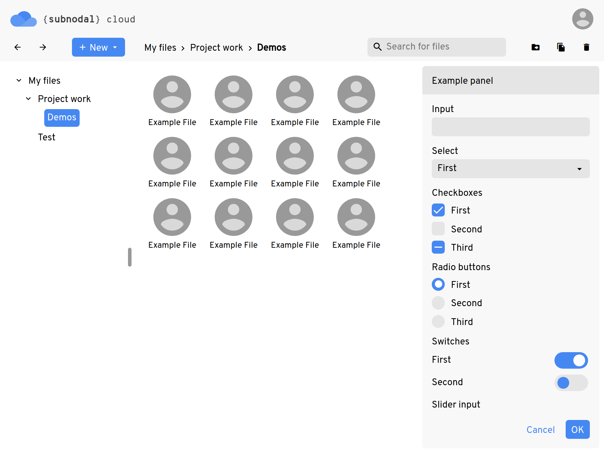

# subUI
A dynamic UI library for creating desktop and mobile applications.

Licenced by the [Subnodal Open-Source Licence](LICENCE.md).

<p align="center">
    
</p>

## Dev environment/distribution
Ensure that you have [subPack](https://github.com/Subnodal/subPack) and
[subDoc](https://github.com/Subnodal/subDoc) installed first. The `dist.py`
script will then invoke subPack and subDoc when building, and will also
additionally minify the CSS files for distribution.

To test or distribute subUI, run:

```bash
$ python3 dist.py
```

You'll need to install the `csscompressor` dependency if you haven't already:

```bash
$ python3 -m pip install csscompressor
```

### Distributing on Windows
Use `py -3` instead of `python3`, since the latter is generally for UNIX
systems.

### For Subnodalers only
When distributing to the [Subnodal CDN](https://cdn.subnodal.com/), the `dist/`
directory should be copied to the CDN under the directory name `lib/subui/`.